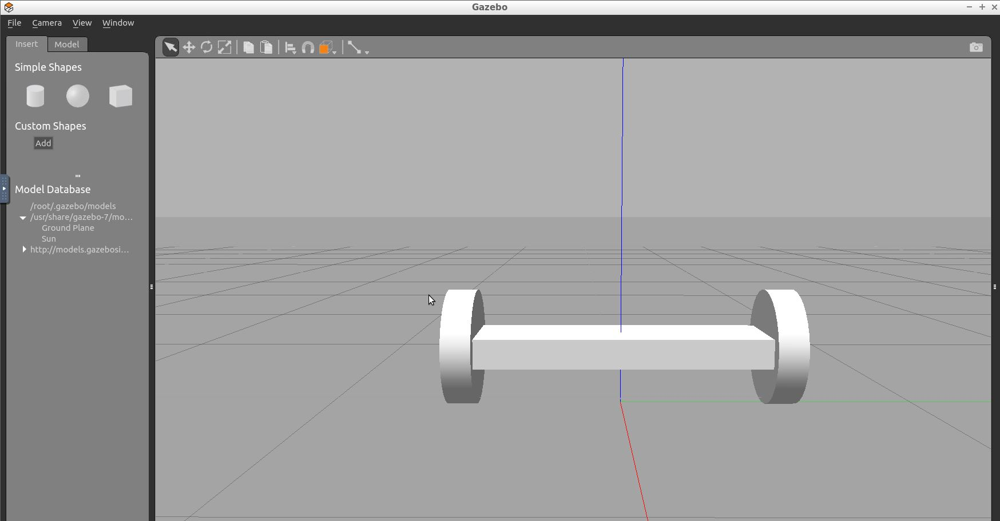
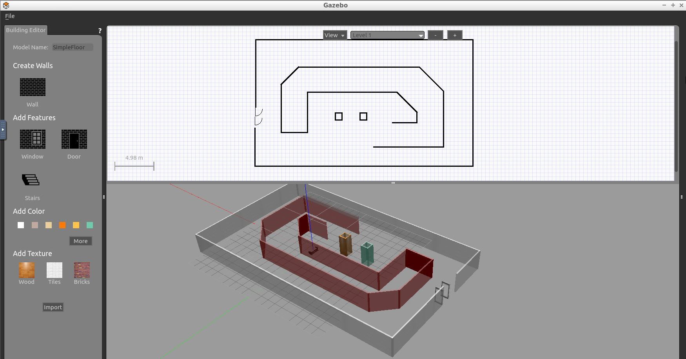
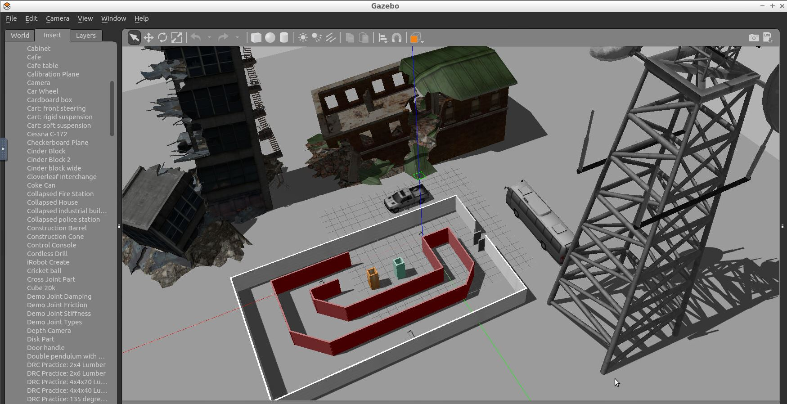
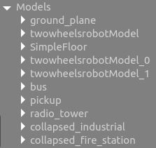
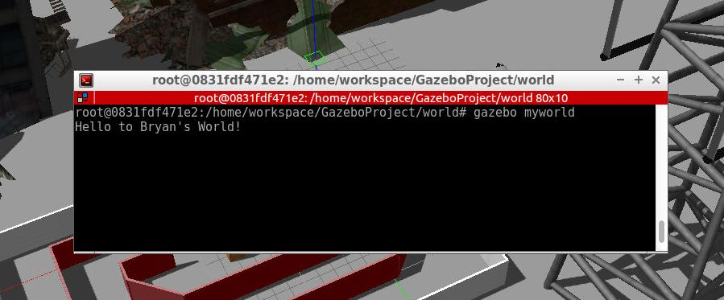

# Gazebo Project
Simple Gazebo World that makes use of Model Editor, Building Editor, and C++ Plugins. 
This repo builds on top of [Udacity RoboND-myrobot repository](https://github.com/udacity/RoboND-myrobot)

### Directory Structure
```
	.GazeboProject
	|-- CMakeLists.txt			# Link libraries
	|-- README.md				
	|-- README_images			# Images used by README.md
	|   `-- ... .jpg
	|-- model
	|   |-- SimpleFloor			# Designed in Gazebo Building Editor
	|   |   |-- model.config
	|   |   `-- model.sdf
	|   `-- robot				# Designed in Gazebo Model Editor
	|       |-- model.config
	|       `-- model.sdf
	|-- script
	|   `-- hello.cpp			# Gazebo plugin C++ script
	`-- world
	    `-- myworld				# World: our models + builtin gazebo models 

```

### Steps to launch the simulation

#### Step 1 Update and upgrade the Workspace image
```sh
$ sudo apt-get update
$ sudo apt-get upgrade -y
```

#### Step 2 Clone the lab folder to your own /home/workspace/ directory
```sh
$ cd /home/workspace/
$ git clone https://github.com/laygond/GazeboProject.git
```

#### Step 3 Compile the code
```sh
$ cd /home/workspace/GazeboProject/
$ mkdir build
$ cd build/
$ cmake ../
$ make
```

#### Step 4 Add our library path to the Gazebo plugin and model path  
```sh
$ export GAZEBO_PLUGIN_PATH=${GAZEBO_PLUGIN_PATH}:/home/workspace/GazeboProject/build
$ export GAZEBO_MODEL_PATH=${GAZEBO_MODEL_PATH}:/home/workspace/GazeboProject/model
```

#### Step 5 Run the Gazebo World file  
```sh
$ cd /home/workspace/GazeboProject/world/
$ gazebo myworld
```

### Output
#### Model Editor
- In gazebo under Edit click on Model Editor.
- Design your robot model, e.g, [model editor tutorial](http://gazebosim.org/tutorials?tut=model_editor)
- Save your robot model under the model folder 
- Exit the editor. 

In this repo the model will be a two-wheeled robot.



#### Building Editor
- In gazebo under Edit click on Building Editor.
- Design your building model, e.g, [building editor tutorial](http://gazebosim.org/tutorials?cat=build_world&tut=building_editor)
- Save your building model under the model folder 
- Exit the editor. 

In this repo the model will be a one floor infrastructure.



#### Insert Models into the World
- In gazebo at the side panel click on tab Insert.
- Include the models previously built through the editors. (if not there already) 
- Include gazebo built-in models to make your world even cooler.
- Save the World



This is the list of all models included. Note that a number is displayed when the more than one instance is included.


#### Plug-in
In directory structure under script folder there is a hello.cpp plugin. This plugin is set to output a message when the world is call through gazebo (Step 5 from above).



    
 
