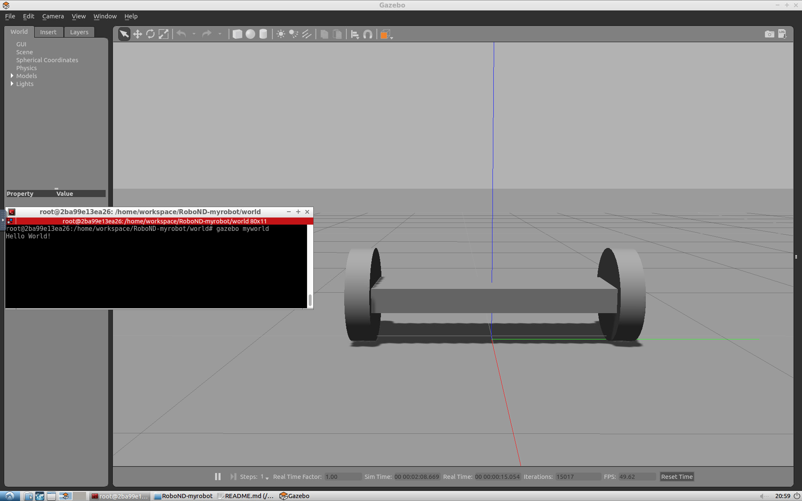

[](https://www.udacity.com/robotics)

add links to tutorials here


# RoboND-myrobot
The **myrobot** lab part of RoboND Gazebo Basics lesson. The purpose of this lab is to learn how to build a two-wheeled robot model with the Model Editor tool in Gazebo. Include this model in an empty Gazebo World. And, finally write a plugin to interact with this world.  

### Directory Structure
```

	.GazeboProject
	|-- CMakeLists.txt			# Link libraries
	|-- README.md				
	|-- README_images			# Images used by README.md
	|   `-- output.png
	|-- model
	|   |-- SimpleFloor			# Designed in Gazebo Building Editor
	|   |   |-- model.config
	|   |   `-- model.sdf
	|   `-- robot				# Designed in Gazebo Model Editor
	|       |-- model.config
	|       `-- model.sdf
	|-- script
	|   `-- hello.cpp			# Gazebo plugin C++ script
	`-- world
	    `-- myworld				# World: our models + builtin gazebo models 

```

### Steps to launch the simulation

#### Step 1 Update and upgrade the Workspace image
```sh
$ sudo apt-get update
$ sudo apt-get upgrade -y
```

#### Step 2 Clone the lab folder in /home/workspace/
```sh
$ cd /home/workspace/
$ git clone https://github.com/udacity/RoboND-myrobot myrobot
```

#### Step 3 Compile the code
```sh
$ cd /home/workspace/GazeboProject/
$ mkdir build
$ cd build/
$ cmake ../
$ make
```

#### Step 4 Add the library path to the Gazebo plugin path  
```sh
$ export GAZEBO_PLUGIN_PATH=${GAZEBO_PLUGIN_PATH}:/home/workspace/GazeboProject/build
```

#### Step 5 Run the Gazebo World file  
```sh
$ cd /home/workspace/GazeboProject/world/
$ gazebo myworld
```

### Output
In gazebo under Edit click on Model Editor. Design your model. Save your model and exit the editor. Your model will be di
The two-wheeled robot inside Model Editor


Building Editor


The hello world message and the two-wheeled robot inside a Gazebo World should both launch as follow: 



    
 
